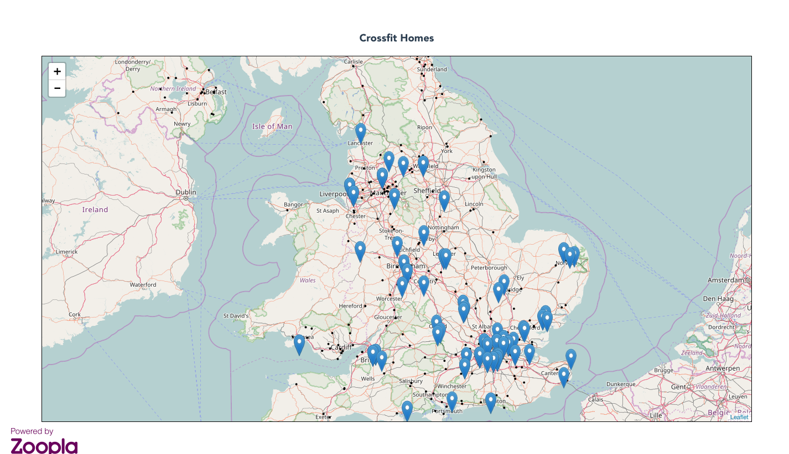

[DEMO](https://polar-anchorage-14859.herokuapp.com/)

A full-stack (MEVN) [leaflet](leafletjs.com) map showing Zoopla listed properties for sale within 8 miles of each CrossFit location, as pulled from the [CrossFit HQ database](https://crossfit.com/cf/find-a-box.php). Made with [Vue2Leaflet](https://github.com/KoRiGaN/Vue2Leaflet).

Uses [Turf.js](turfjs.org) to build buffers around each crossfit point, and to filter [Zoopla API](http://developer.zoopla.com/) results to only those properties within any buffer polygon.

Node back-end specifies parameters to Zoopla that could be changed through Vue.js front-end. For example, user could change max price, or look at specific countries within the UK. 

Ideas for future development:
* find nearest crossfit to each property and display crossfit location name in popup
* update property results on map change by sending map bounds to zoopla 